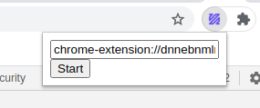

ffmpeg.wasm Chrome Extension
============================

An example to use ffmpeg.wasm in Chrome Extension.

In this example, it transcodes a flv file inside extension by default, you can replace it with any other URL.

